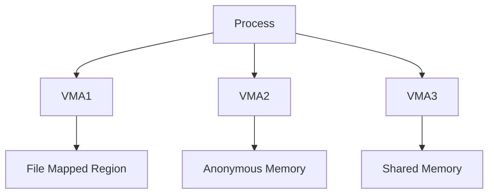
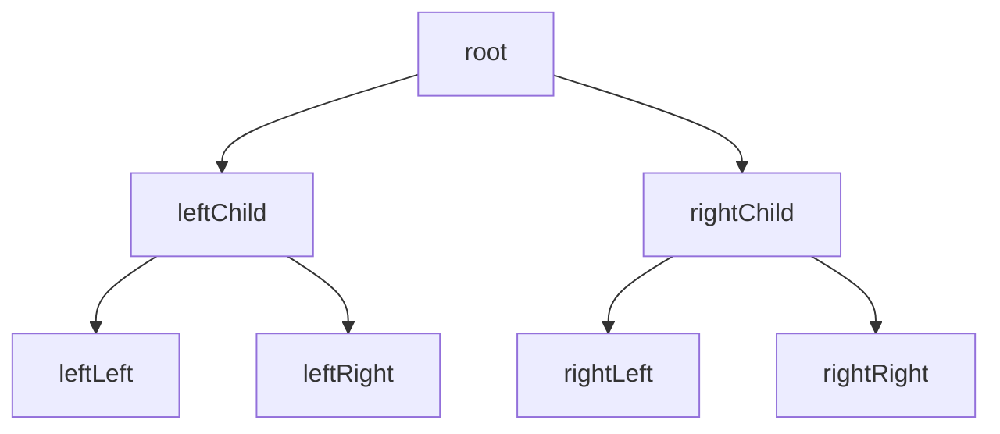
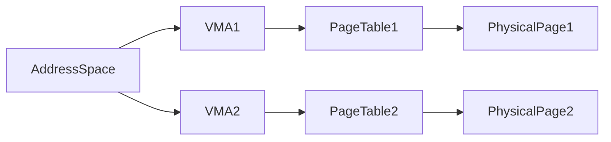
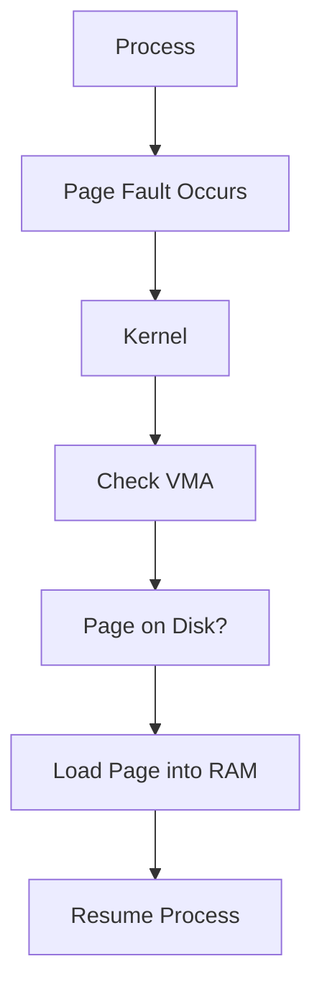
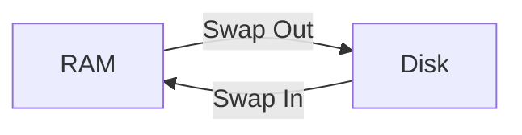

# Process Memory Management and Buffer Cache in Linux Kernel 6.10

**Disclaimer:** This document contains Mermaid diagrams. To view these diagrams properly, you'll need a Mermaid-compatible Markdown viewer or extension. If you're unable to see the diagrams, please refer to the GitHub repository linked below for proper visualization.

For a complete visualization of the concepts discussed in this blog, including additional diagrams and code examples, please visit:
https://github.com/pauljainta/linux-page-cache

Memory management is one of the most fundamental parts of an operating system, and Linux Kernel 6.10 provides sophisticated mechanisms to handle it efficiently. This post will outline key concepts in process memory management and the buffer cache, such as Virtual Memory Areas (VMAs), red-black trees, reverse mapping for anonymous and file-mapped memory, and address spaces. We will also delve into how page faults are handled and the workings of swap in and swap out operations.

## Virtual Memory Areas (VMAs)

In Linux, each process has its own virtual address space. The kernel uses **Virtual Memory Areas (VMAs)** to track continuous memory regions within this space. VMAs represent ranges of virtual addresses associated with file mappings, anonymous memory, or shared memory.

Each process maintains a linked list or **red-black tree** (a type of self-balancing binary search tree) of VMAs. These trees help speed up memory lookups by balancing the complexity of insertion, deletion, and search operations to O(log n).

VMAs are critical in process memory management because they allow the kernel to map virtual addresses to physical memory and manage page protections.

### **Mermaid Diagram: VMA Structure in Memory**

## Red-Black Trees

To manage VMAs efficiently, Linux uses **red-black trees**, which ensure a balanced search structure for faster access. These trees store VMAs for each process in such a way that allows rapid searching during page fault handling.

### **Mermaid Diagram: Red-Black Tree**

## Reverse Mapping

Linux employs **reverse mapping** to track the relationship between physical memory pages and their corresponding VMAs. Reverse mapping plays a key role in two main scenarios:
- **Anonymous Memory:** Memory not backed by a file. Reverse mapping helps identify which processes map to a specific anonymous page.
- **File-mapped Memory:** Memory backed by a file. Reverse mapping is useful for shared files to track which pages are used by multiple processes.

Reverse mapping simplifies tasks like page migration, page reclaiming, and swap management.

## Address Spaces

Each process in Linux is given its own **address space** consisting of the VMAs it owns. An address space is managed by the kernel's memory management subsystem and includes information about mapped regions (VMAs), page tables, and cache mechanisms.

### **Mermaid Diagram: Address Space**

## Page Fault Handling

When a process tries to access memory that is not currently in RAM (i.e., a **page fault** occurs), the Linux kernel steps in to resolve the issue. Page faults are generally categorized into two types:
- **Minor Page Faults:** These occur when the page is already in memory but not mapped to the process's address space. The kernel quickly fixes the mapping without disk I/O.
- **Major Page Faults:** These occur when the requested page is not in RAM, and the kernel must load it from disk. Major page faults involve significant overhead as they may trigger disk I/O.

### **Mermaid Diagram: Page Fault Handling**

## Swap In and Swap Out Operations

When the system runs out of physical memory, the kernel may need to **swap out** pages from RAM to disk to free space. Conversely, when a page is needed again, it is **swapped in** from disk back into RAM.

- **Swap Out:** The kernel selects a page (often using a Least Recently Used (LRU) algorithm) and writes it to the swap space on disk.
- **Swap In:** If a process accesses a swapped-out page, the kernel reads the page back into RAM from swap space, potentially swapping out another page to make room.

### **Mermaid Diagram: Swap Process**

### Conclusion

Linux Kernel 6.10 implements efficient memory management mechanisms like VMAs, red-black trees, reverse mapping, and swap management to ensure optimal performance and scalability. Understanding these components helps system administrators and developers grasp the nuances of how Linux handles memory, ultimately leading to better system optimization and performance troubleshooting.

For more detailed information, code examples, and additional visualizations, please refer to the GitHub repository: https://github.com/pauljainta/linux-page-cache